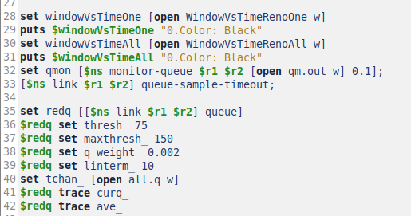
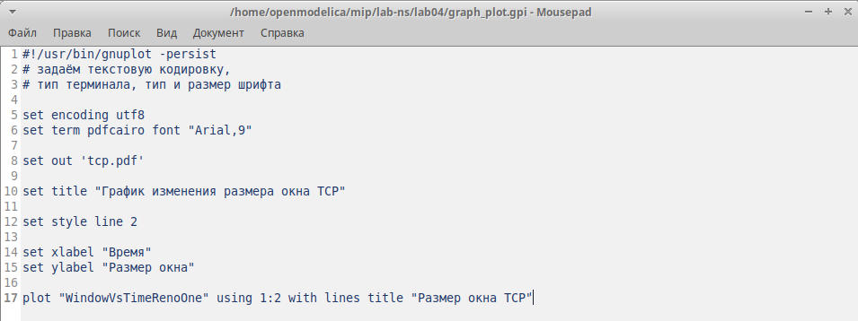
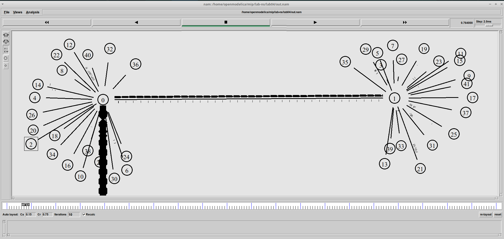

---
## Front matter
lang: ru-RU
title: Лабораторная работа № 4
subtitle: Имитационное моделирование
author:
  - Королёв И.А.
institute:
  - Российский университет дружбы народов, Москва, Россия

## i18n babel
babel-lang: russian
babel-otherlangs: english

## Formatting pdf
toc: false
toc-title: Содержание
slide_level: 2
aspectratio: 169
section-titles: true
theme: metropolis
header-includes:
 - \metroset{progressbar=frametitle,sectionpage=progressbar,numbering=fraction}
---

# Информация

## Докладчик

:::::::::::::: {.columns align=center}
::: {.column width="70%"}

  * Королёв Иван Андреевич
  * Студент
  * Российский университет дружбы народов

:::
::::::::::::::

# Цель работы

Закрепить и продемонстрировать навыки самостоятельной разработки имитационной модели в пакете NS-2 и построении графиков.

# Задание

1. По приведенной схеме разработать имитационную модель в пакете NS-2.

2. Построить график изменения размера окна TCP (в Xgraph и в GNUPlot);

3. Построить график изменения длины очереди и средней длины очереди на первом
маршрутизаторе.

# Теоретическое введение

Network Simulator (NS-2) — один из программных симуляторов моделирования
процессов в компьютерных сетях. NS-2 позволяет описать топологию сети, конфигурацию источников и приёмников трафика, параметры соединений (полосу
пропускания, задержку, вероятность потерь пакетов и т.д.) и множество других
параметров моделируемой системы. Данные о динамике трафика, состоянии соединений и объектов сети, а также информация о работе протоколов фиксируются
в генерируемом trace-файле.

# Выполнение лабораторной работы

# Разработка имитационной модели по схеме

{#fig:001 width=55%}

# Создание и соединение узлов.

Создание и соединение узлов.

{#fig:002 width=55%}

# Мониторинг размера окна TCP и очереди 

{#fig:003 width=55%}

# Формирование файла с данными о размере окна TCP

{#fig:004 width=55%}

# Процедура finish, которая завершает симуляцию и запускает анализ результатов 

{#fig:005 width=55%}

# Добавление at-событий и запуск модели.

{#fig:006 width=55%}

# График изменения размера окна TCP (в Xgraph и в GNUPlot)

{#fig:007 width=55%}

# График изменения размера окна TCP P на всех источниках при N=20 в Xgraph. 

{#fig:008 width=55%}

# График изменения размера окна TCP в GNUPlot. Текущий размер очереди показывает высокие колебания. 

{#fig:009 width=55%}

# График изменения размера окна TCP в GNUPlot. Текущий размер очереди показывает высокие колебания. 

{#fig:0010 width=55%}

# Построить график изменения длины очереди и средней длины очереди на первом маршрутизаторе.

# Изменение размера длины очереди на линке (R1–R2) при N=20

{#fig:0011 width=55%}

# Изменение размера средней длины очереди на линке (R1–R2) при N=20

{#fig:0012 width=55%}

# Демонстрация работы модели

Передача пакетов из узлов к маршрутизатору ноль. От маршрутизатора ноль пакеты идут к маршрутизатору 1 и распределяются от него по узлам, соединенным с ним.

{#fig:0013 width=55%}

# Демонстрация работы модели

При переполнении очереди происходит сброс 

{#fig:0014 width=55%}

# Выводы

Закрепил и продемонстрировал навыки самостоятельной разработки имитационной модели в пакете NS-2 и построил графики.

# Список литературы{.unnumbered}

::: {#refs}
:::
